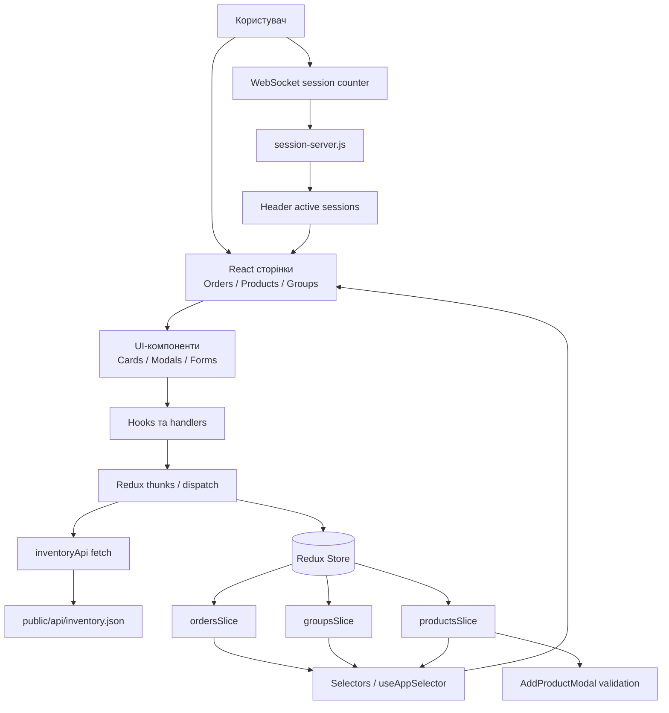

# Orders & Products SPA

Невеликий SPA-проєкт для обліку замовлень, товарів і груп товарів. Проєкт зроблений на React + TypeScript, стилі написані на SCSS, глобальний стан винесений у Redux Toolkit, а навігація побудована через React Router.

У поточному стані застосунок має три основні робочі сторінки: Orders, Products і Groups, верхню панель з пошуком та блоком дати/часу, лівий сайдбар, спільну модель даних для замовлень і груп, REST-подібне завантаження даних через fetch, а також websocket-лічильник активних сесій.

## Передумови

Для локального запуску потрібні:

1. Node.js 18+ або 20+
2. npm 9+
3. Два окремі термінали для frontend і socket-server

## Live Demo

Актуальні Railway-посилання:

1. Frontend URL: `https://chic-imagination-production-aa65.up.railway.app`
2. Socket server URL: `https://dztask04-production.up.railway.app`

## Запуск

Після клонування потрібно встановити залежності один раз:

```bash
npm install
```

Далі застосунок запускається у двох окремих терміналах.

Термінал 1, frontend:

```bash
npm start
```

Термінал 2, websocket server:

```bash
npm run socket-server
```

Основний застосунок відкривається на http://localhost:3000.

Лічильник активних сесій працює через окремий socket-server за адресою http://localhost:4000.

Для перевірки збірки:

```bash
npm run build
```

Для тестів:

```bash
npm test
```

## Deployment та env

Для production frontend очікує змінну середовища:

```bash
REACT_APP_SOCKET_URL=https://your-socket-server-url
```

Локально, якщо змінна не задана, клієнт використовує значення за замовчуванням:

```bash
http://localhost:4000
```

У поточному деплої обидва сервіси розгорнуті на Railway як два окремі сервіси в межах одного проєкту:

1. frontend: `https://chic-imagination-production-aa65.up.railway.app`
2. websocket server: `https://dztask04-production.up.railway.app`

## Дані та API

Застосунок завантажує дані через fetch із публічного endpoint:

- public/api/inventory.json

Для цього в коді використовується сервіс:

- src/services/inventoryApi.ts

А гідрація Redux store виконується через thunk:

- src/store/inventoryThunks.ts

Тобто дані в UI вже не читаються напряму з mock-масивів, а підтягуються через REST-подібний шар з асинхронним завантаженням.

## Що реалізовано

З боку звичайного junior-рівня тут уже є базовий SPA на React з TypeScript, роутинг між сторінками, компонентна структура, Redux store, сторінки зі списками даних, фільтрація і пошук, адаптивна верстка, SCSS-стилізація, а також робота з моковими даними. Дані пов’язані між собою через orderId і groupId, тому Orders, Products і Groups працюють не як ізольовані сторінки, а як частини однієї моделі.

Ключова прикладна логіка реалізована саме навколо трьох основних сторінок, а не двох. Сторінка Orders (Приходи) показує список приходів і дає можливість перейти до пов’язаного набору товарів. При відкритті такого переходу користувач потрапляє на сторінку Groups, де інтерфейс побудований у форматі master-detail: з одного боку відображається список груп, а поруч показується список продуктів для вибраної групи. Тобто сторінка Groups реалізована не просто як окремий список груп, а у форматі, близькому до тестового скріншота, де суттєва частина екрана відведена під конкретні продукти вибраної групи.

Таким чином перевіряючий бачить не лише наявність сторінок Orders, Products і Groups, а й реальний сценарій роботи між ними: з Приходів можна відкрити пов’язаний перелік товарів, а на Groups цей перелік відображається в контексті конкретної групи поруч із загальним списком груп.

З боку junior+ тут уже є кілька речей, які виходять за межі простого CRUD на моках. Сторінки підключені через lazy loading, тому код ділиться на окремі чанки і не вантажиться весь одразу. Дані завантажуються через fetch-based service layer у `src/services/inventoryApi.ts`, що наближає застосунок до реального REST flow. Для ключових частин логіки додані unit-тести: окремо перевіряється service-layer і окремо reducer для productsSlice. Також є socket.io-сервер для показу активних сесій у top bar, а частина дрібних оптимізацій зроблена для зменшення зайвих перерендерів.

Окремо форма додавання товару в групу тепер має сильнішу клієнтську валідацію: перевіряються обов'язкові поля, мінімальна довжина, не-негативні ціни, а також логіка гарантійних дат. Для демонстрації роботи з CSS framework у проєкт підключений Bootstrap, і форма/modal використовує його базові form/button класи поряд із власною SCSS/BEM-стилізацією.

Окремо в проєкті вже виконані прикладні оптимізації продуктивності. Обрахунки для фільтрації, мап зв’язків між сутностями, пошукових результатів, списків по приходах і лічильників по групах винесені в memoized-обчислення, щоб не перераховувати їх на кожен ререндер. Поля пошуку працюють через debounce, тому інтерфейс не реагує важкими обчисленнями на кожен символ миттєво. Сторінки підвантажуються через lazy loading, тому стартовий bundle менший і початкове завантаження легше. Блок дати й часу оновлюється не щосекунди, а синхронізується по хвилинах, що прибирає постійний фоновий шум ререндерів у header. Оновлення кількості активних сесій іде через websocket, але стан змінюється лише коли значення реально відрізняється, а логіка підключення налаштована без агресивних перепідключень. Додатково навігаційні й route-залежні частини не роблять зайвих переходів, якщо параметри пошуку не змінилися. У сумі це робить інтерфейс спокійнішим і дешевшим по зайвих оновленнях.

## Покриття вимог для junior / junior+

### Уже реалізовано на рівні junior

1. React SPA з TypeScript і компонентною структурою.
2. Роутинг між трьома основними робочими сторінками Orders, Products, Groups, а також додатковими Users і Settings.
3. Redux Toolkit store для централізованого стану.
4. Списки сутностей, пошук, фільтрація і пов’язаність даних між orders, groups і products.
5. Адаптивна SCSS/BEM-верстка з власними UI-компонентами.
6. Форми взаємодії з користувачем: додавання товару, підтвердження видалення, навігація між сутностями.
7. Реальний користувацький сценарій переходу з Orders у Groups для перегляду конкретних продуктів пов’язаної групи.

### Уже реалізовано на рівні junior+

1. Async fetch-based service layer через `public/api/inventory.json`, `src/services/inventoryApi.ts` і `src/store/inventoryThunks.ts`.
2. Code splitting через lazy loading сторінок.
3. Сильніша клієнтська валідація форми додавання товару з окремими type/validation модулями.
4. Інтеграція Bootstrap як реальної залежності з використанням у формі та кнопках.
5. WebSocket-лічильник активних сесій через socket.io server/client.
6. Unit-тести для service-layer і reducer-логіки.
7. SQL-схема БД у `database/schema.sql`.
8. Docker-артефакти для production-like запуску: `Dockerfile`, `Dockerfile.socket`, `docker-compose.yml`, `nginx.conf`.
9. Оптимізації продуктивності: debounce, memoized обчислення, контроль зайвих перерендерів, полегшене оновлення часу в header.

### Як це виглядає для перевіряючого

Цей SPA уже виходить за межі мінімального junior CRUD на моках. Тут є не лише UI і базовий state management, а й формалізований fetch-flow, сильніша валідація, WebSocket-інтеграція, unit-тести, схема БД і підготовлена контейнеризація, тобто набір артефактів, який уже ближчий до junior+ реалізації.

## Як це організовано

Роутинг і lazy loading зібрані в `src/App.tsx`. Дані для store завантажуються через `src/services/inventoryApi.ts` і `src/store/inventoryThunks.ts`. Стан розкладений по slices у `src/store`. Основний UI лежить у `src/components`, а сторінки винесені в `src/pages`. Моки залишаються в `src/mock` як джерело початкових даних для підготовки REST JSON snapshot.

## Артефакти тестового

У репозиторії вже додані або підготовлені такі артефакти:

1. README з описом запуску і функціоналу
2. Git-репозиторій зі структурованим кодом
3. SQL-схема даних: `database/schema.sql`
4. Docker strategy документ без вимоги локального запуску Docker: `docs/docker-strategy.md`
5. Dockerfile для frontend SPA: `Dockerfile`
6. Dockerfile для websocket server: `Dockerfile.socket`
7. Compose-конфігурація: `docker-compose.yml`

Контейнеризація підготовлена як артефакт для remote/CI validation. Через слабке локальне залізо вона не вважається локально провалідаваною, але конфігурація вже готова до перевірки на іншій машині.

## Docker

Frontend і websocket server розділені на два сервіси.

Запуск через Docker Compose:

```bash
docker compose up --build
```

Сервіси:

1. `frontend` — production build React SPA, який віддається через nginx
2. `socket-server` — окремий Node.js container для Socket.io active sessions counter

### Обмеження локальної Docker-перевірки

Docker-конфігурація підготовлена повністю, але локальна повна перевірка контейнерів може бути обмежена ресурсами машини. Через це Docker-артефакти в цьому репозиторії підготовлені як reproducible deployment setup для перевірки на іншій машині, хостингу або VDS.

## Тести і перевірка

На цій стадії є unit-тести для service-layer і для reducer-логіки productsSlice. Вони перевіряють, що сервіс повертає окремі копії даних, що snapshot містить повний набір сутностей, що видалення продукту працює по id і що додавання нового продукту створює очікувані дефолтні поля.

Остання перевірка пройшла успішно: production build зібрався без помилок, а нові тести не зламали проєкт.

## Самоперевірка

Перед передачею тестового проєкт можна перевірити з нуля за такою послідовністю:

1. Клонувати репозиторій.
2. Виконати `npm install`.
3. У першому терміналі виконати `npm start`.
4. У другому терміналі виконати `npm run socket-server`.
5. Переконатися, що frontend відкривається на http://localhost:3000.
6. Переконатися, що websocket server працює на http://localhost:4000.
7. Перевірити production build через `npm run build`.
8. Перевірити тести через `npm test`.
9. За потреби окремо перевірити контейнеризацію через `docker compose up --build` на машині, де доступний Docker runtime.

## Схема взаємодії


